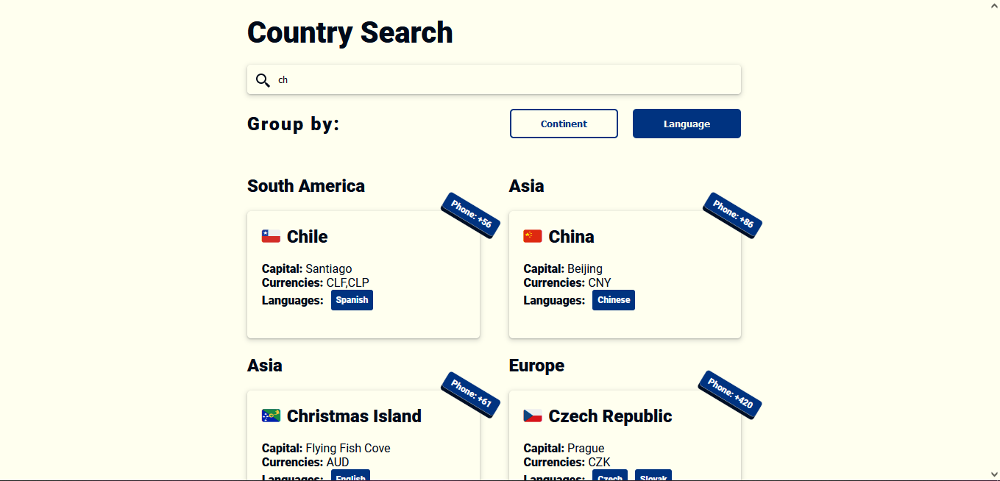

\*\*\*\*# Desafío para Software Engineers

Nombre postulante: [Anthony Rosman](https://www.anthonyrosman.com/)

Link a la app en producción: [LINK DEL DEPLOY](https://kimche-anthonyrosman.netlify.app/)

## Preview

## Aviso

Hola, queria indicarles que con la api de [countries.trevorblades.com](https://countries.trevorblades.com/) en windows 10 da problemas los emojis, segun lei es por problemas de politicas, adjunto el link donde dice porque
[Microsoft no muestra los emojis](https://answers.microsoft.com/en-us/windows/forum/all/flag-emoji/85b163bc-786a-4918-9042-763ccf4b6c05)

## Pregunta de la base de datos

Se podria intentar el uso de una arquitectura noSql como mongo porque tiene mejor rendimiento en tiempo de escritura porque no requieren controlar las restricciones (esquemas,llaves,etc), que aunque no cumplan con el principio ACID podria ser una buena alternativa.

